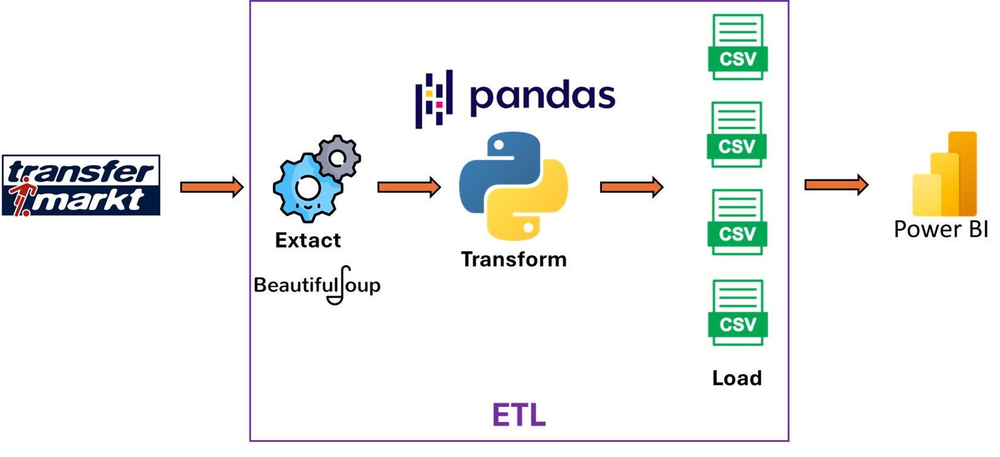
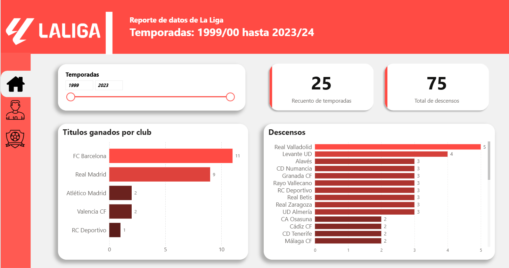
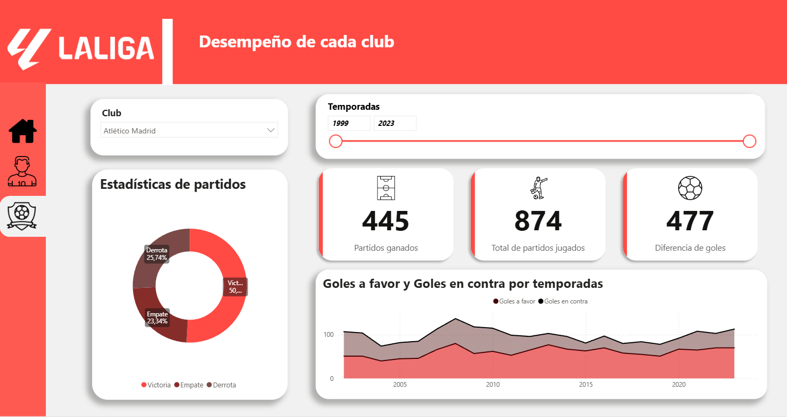
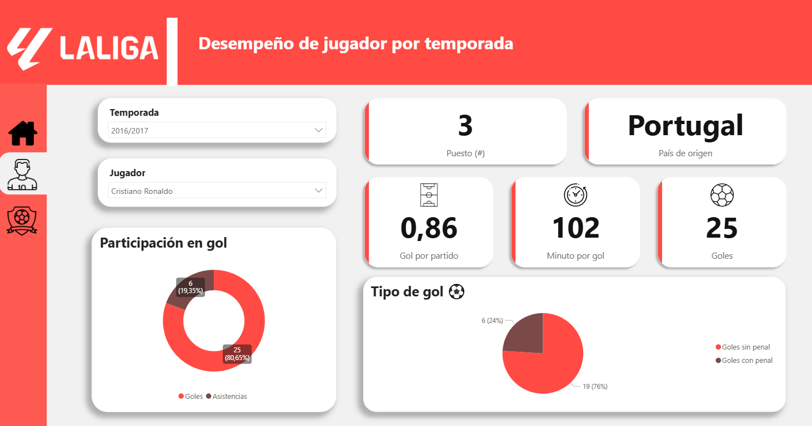

# La Liga data project

Este proyecto con fines académicos pretende recopilar y analizar la información de los clubes y jugadores de La Liga de la página de Transfermarkt mediante el uso de técnicas de web scrapping. El trabajo contempla la información desde la temporada 1999/2000 hasta la temporada 2023/2024, de esta manera se puede estudiar el rendimiento de los equipos y jugadores involucrados en La Liga durante este siglo.

## Dashboard

Para visualizar el dashboard ingresar a:  
<https://app.powerbi.com/view?r=eyJrIjoiNmUyOWMwZTEtNjgxZi00OWNkLWJlNDAtZTQ1YjFkNDFjZGQ2IiwidCI6IjBlMGNiMDYwLTA5YWQtNDlmNS1hMDA1LTY4YjliNDlhYTFmNiIsImMiOjR9>

### Tecnologías utilizadas:
Para el desarrollo de este trabajo se contempla el uso de:
- Python 3.11.7
  - Pandas
  - Numpy
  - BeautifulSoup
- PowerBI

### Objetivos:
1. Realizar la ejecución de la parte práctica de las técnicas de web scrapping.
2. Obtener la data con el proceso de ETL (extracción, transoformación y carga) para su análisis correspondiente.
3. Visualizar la información en dashboards interactiovos que le impidan que al usuario se limite a la lectura de tablas cuando quiero ver información sobre este tema.

### KPIs:
Para cada sección del dashboard se consideraron los siguientes indicadores como categorías a analizar:

*Reporte de datos de La Liga*
- Total de temporadas analizadas
- Cantidad de descensos
- Títulos ganados por club
- Clubes con mayor número de descensos

*Desempeño de jugador por temporada*
- Total de goles por temporada
- Promedio de goles por partido
- Minutos por gol
- Ranking del jugador entre los goleadores de la temporada
- País de origen del jugador
- Porcentaje de participación en goles (goles y asistencias)
- Tipo de goles (con penal / sin penal)

*Desempeño de cada club*
- Total de partidos jugados
- Total de partidos ganados
- Diferencia de goles acumulada
- Porcentaje de victorias, empate y derrotas
- Evolución de goles a favor y goles en contra por temporada

### Esquema del funcionamiento del programa:
Esquema que muestra el proceso ETL del trabajo.

### Resultado final:
Previsualización:

#### Vista general:

#### Clubes:

#### Goleadores:

### Conclusiones:

- El uso de técnicas de web scraping permitió obtener de forma automatizada y estructurada información histórica de La Liga, abarcando desde la temporada 1999/2000 hasta la 2023/2024.
- La aplicación de un flujo ETL me permitió cumplir con la limpieza, transformación y carga de los datos, asegurando su consistencia para el análisis.
- A nivel de clubes, se evidencia una concentración de títulos ganados más de una vez en un número reducido de equipos, mientras que una mayor cantidad de clubes presenta una rotación frecuente entre ascensos y descensos, lo que refleja una brecha competitiva dentro de la liga.
- El análisis del rendimiento de los jugadores por temporada revela información relevante sobre la productividad ofensiva, como goles por partido, minutos por gol y participación directa en goles, lo que permite evaluar de manera objetiva el impacto individual de cada jugador.
- El club con mayor número de títulos obtenidos a lo largo de las temporadas analizadas es el FC Barcelona.
- En total, se analizaron 25 temporadas de La Liga, en las cuales se registraron 75 descensos.
- Asimismo, se observa que la mayoría de los goleadores presentan una menor proporción de goles convertidos desde el punto penal en comparación con aquellos anotados en jugadas.

